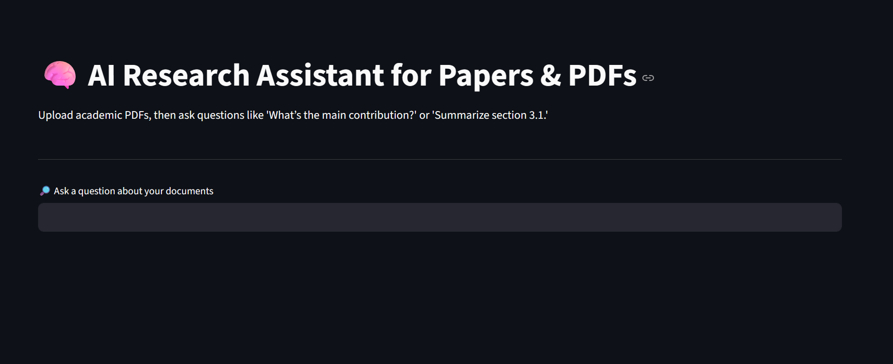
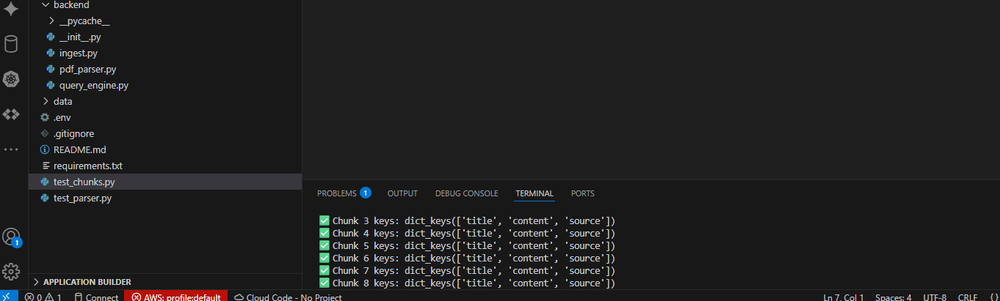
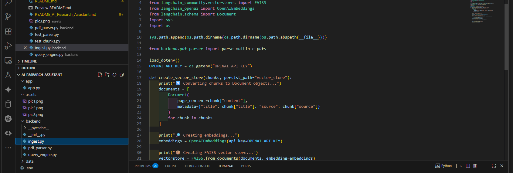

# 🧠 AI Research Assistant for Papers & PDFs

This Streamlit app allows users to upload academic PDFs and interactively query them using natural language. Powered by OpenAI embeddings and a FAISS vector store, this assistant can answer questions like:

> “What’s the main contribution?”  
> “Summarize section 3.1.”  
> “List the datasets used in the study.”

---

## ⚙️ Features

- ✅ Upload multiple PDFs at once
- 📄 Automatically parses and chunks documents with `PyMuPDF`
- 🧠 Embeds chunks using OpenAI’s `text-embedding-ada-002`
- 🔍 Stores vector representations in a FAISS index
- 💬 Uses LangChain’s `RetrievalQA` to answer questions
- 🔗 Displays source document titles for traceability
- 🧪 Includes test scripts for validating chunks and parsing

---

## 🖼️ Preview

| Feature | Screenshot |
|--------|------------|
| 🌐 Streamlit UI for querying academic PDFs |  |
| 🔍 Chunk metadata (title, content, source) in terminal |  |
| 🧠 Ingest & Embed Script |  |

---

## 🚀 How It Works

1. **PDF Upload:** PDFs are uploaded via the Streamlit UI.
2. **Parsing:** `PyMuPDF` extracts and chunks text by section titles.
3. **Vectorization:** Each chunk is embedded using OpenAI.
4. **Storage:** FAISS stores these embeddings for semantic search.
5. **Query:** LangChain’s `RetrievalQA` retrieves relevant chunks and answers questions.

---

## 📂 Folder Structure

```
backend/
├── __init__.py
├── ingest.py
├── pdf_parser.py
├── query_engine.py
├── test_chunks.py
├── test_parser.py
├── data/ (uploaded PDFs)
├── .env
├── requirements.txt
└── README.md
```

---

## 📦 Setup Instructions

1. **Clone the repo**  
```bash
git clone https://github.com/YOUR_USERNAME/ai-research-assistant.git
cd ai-research-assistant
```

2. **Install requirements**  
```bash
pip install -r requirements.txt
```

3. **Add your API key** to a `.env` file:  
```
OPENAI_API_KEY=your_key_here
```

4. **Run ingestion script**  
```bash
python backend/ingest.py
```

5. **Launch the app**  
```bash
streamlit run app.py
```

---

## 🛠️ Troubleshooting

**Error:** `NameError: name 'qa_chain' is not defined`  
**Solution:** Make sure to define the chain first:

```python
qa_chain = RetrievalQA.from_chain_type(
    llm=OpenAI(),
    retriever=vectorstore.as_retriever()
)
```

---

## 📬 Contact

For consulting, enhancements, or integration with your academic tools, reach out on [Upwork](https://www.upwork.com/freelancers/~01abcdefg) or [LinkedIn](https://www.linkedin.com/in/maurice-colon/).

---

**License:** MIT  
© 2025 Maurice J. Colon – AI/ML + AWS Consultant

## 🧰 Common Troubleshooting Tips

Here are some common issues and how to resolve them:

### 1. `ModuleNotFoundError` for Langchain or other libraries
- ✅ **Fix**: Run `pip install -r requirements.txt`
- 🔄 Double-check your virtual environment is activated: `source venv/bin/activate` or `.env\Scriptsctivate` on Windows.

### 2. `KeyError: 'source'` or Missing Metadata
- ✅ **Fix**: Make sure your `pdf_parser.py` outputs dictionaries with `"title"`, `"content"`, and `"source"` keys.

### 3. Old API key is being used despite updating `.env`
- ✅ **Fix**: Restart your terminal and IDE, and confirm with `print(os.getenv("OPENAI_API_KEY"))` that the correct key is loaded.
- 🧼 Clear any system environment variable overrides: `unset OPENAI_API_KEY` (Unix) or `set OPENAI_API_KEY=` (Windows).

### 4. `qa_chain` or any variable not defined
- ✅ **Fix**: Make sure all required functions and variables are defined or imported in your script (e.g., `qa_chain = create_qa_chain(...)`).

### 5. `gTTS` Audio Not Playing in Streamlit
- ✅ **Fix**: Ensure `gTTS` is installed and supported by your environment.
- 📦 Try running `pip install gTTS` and confirm with a simple `gTTS(text="Hello", lang="en").save("test.mp3")` test.
- 🔊 In Streamlit, use `st.audio(audio_bytes, format="audio/mp3")` after converting the file.

### 6. PDF Uploads Not Reflected in Vector Store
- ✅ **Fix**: Check that your uploader writes PDFs to the correct path (`/data` or `/uploaded_docs`), and that ingestion is re-run after upload.
- 📎 Consider adding a file list view in the sidebar to confirm what’s loaded.

---